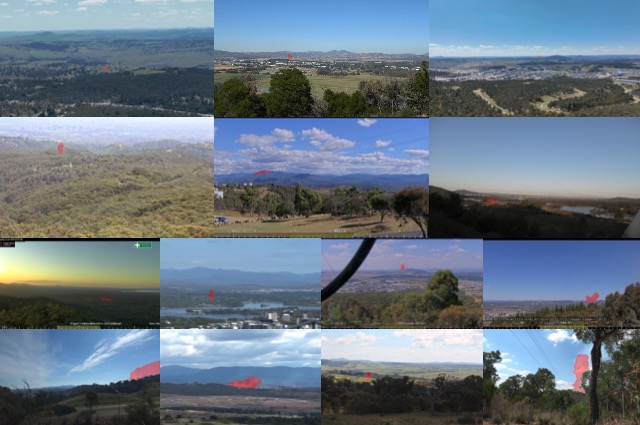
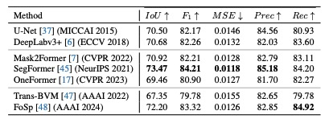
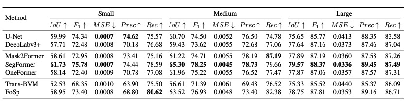
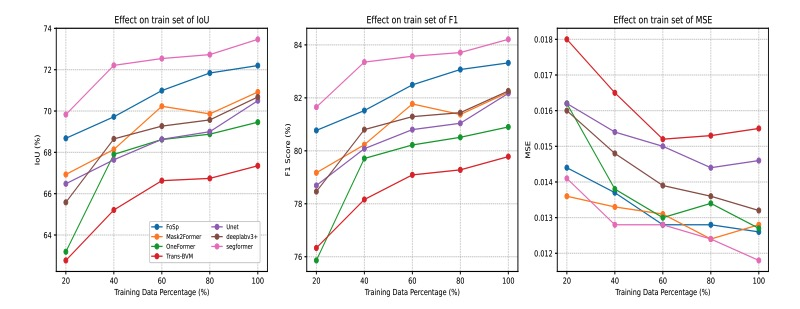

# [WACV 2026] AusSmoke meets MultiNatSmoke: a fully-labelled diverse smoke segmentation dataset

---

## Overview


The official implement for our WACV 2026 paper **AusSmoke meets MultiNatSmoke: a fully-labelled diverse smoke segmentation dataset**. It provides:

- A new wildfire smoke segmentation dataset, named **MultiNatSmoke**, including smoke images around the world. 
- Evaluation scripts for state-of-the-art segmentation models on MultiNatSmoke.
- Baseline results and benchmark metrics.

---

## Datasets

Our dataset is partially compiled from various existing public datasets, with **added segmentation labels**. Please ensure you **cite the original datasets** before downloading or using our dataset. Most datasets are included in this release; however, the **Forest Fire** dataset requires a separate download. Use the script `curate_kaggle_forest_fire.py` (included in  `code/lib` folder) for downloading and extracting the images.  

| Dataset | Link | License |
|---------|------|---------|
| **FIgLib** | [Link](https://www.hpwren.ucsd.edu/FIgLib/) | – |
| **Smoke5K** | [Link](https://github.com/SiyuanYan1/Transmission-BVM) | – |
| **SmokeSeg** | [Link](https://github.com/LujianYao/FoSp) | – |
| **AI-for-Mankind** | [Link](https://github.com/aiformankind/wildfire-smoke-dataset?tab=readme-ov-file) | CC BY-NC-SA 4.0 |
| **Firecam** | [Link](https://github.com/open-climate-tech/firecam/tree/master/datasets/2019a) | CC BY-NC-SA 4.0 |
| **Boreal Forest Fire** | [Link](https://etsin.fairdata.fi/dataset/1dce1023-493a-4d63-a906-f2a44f831898) | CC BY 4.0 |
| **D-Fire** | [Link](https://github.com/gaia-solutions-on-demand/DFireDataset) | CC0 1.0 (Public Domain) |
| **WSDataset** | [Link](https://www.kaggle.com/datasets/gloryvu/wildfire-smoke-detection) | MIT |
| **FireSpot** | [Link](https://github.com/Biometrix-4/FireSpot-CNX) | CC BY 4.0 |
| **FESB-MLID** | [Link](http://wildfire.fesb.hr/index.php?option=com_content&view=article&id=66%20&Itemid=76) | – |
| **Forest Fire** | [Link](https://www.kaggle.com/datasets/kutaykutlu/forest-fire) | – |

> **Note:** Please use the references listed in the **Citation** section of this repository when citing these datasets.

---

## Supported Models

We evaluate the following state-of-the-art segmentation models:

- **U-Net** (CNN-based)
- **DeepLabV3+** (CNN-based)
- **SegFormer** (transformer-based)
- **Mask2Former** (transformer-based)
- **FoSp** (domain-spefic)
- **Trans-BVM** (domain-spefic)

> The FoSp and Trans-BVM implementations follow their respective official repositories
   * **FoSp**: follow instructions and code at [LujianYao/FoSp](https://github.com/LujianYao/FoSp)
   * **Trans-BVM**: follow instructions and code at [SiyuanYan1/Transmission-BVM](https://github.com/SiyuanYan1/Transmission-BVM)

  please visit above github repos for evaluating **FoSp** and  **Trans-BVM**

---

## Usage

1. **Prepare the MultiNatSmoke dataset**

   * Download MultiNatSmoke Dataset at [[Hugging Face 🤗]](https://huggingface.co/datasets/hongjinzhao0615/MultiNatSmoke)

2. **Run Forest Fire Dataset Download Script**

  ```bash
   python lib/curate_forest_fire.py
   ```

3. **Train a model**

   ```bash
   python model_name/train.py
   ```

  Replace `model_name` with one of the following:
  * `deeplabv3+`
  * `mask2former`
  * `oneformer`
  * `segformer`
  * `unet`


  Model performance will be evaluated used IoU, MSE, F1, Precision and Recall.

---


## Result

1. **Performance on state-of-the-art segmentation models**
  
  

2. **Performance across varying training data percentages**
  

---

## Citation
If you find our work is useful for your research and works, please cite using below BibTeX:
```bibtex

@InProceedings{Li_2026_WACV,
    author    = {Li, Weihao and Zhao, Hongjin and Zhu, Gao and Ji, Ge-Peng and Wilson, Nicholas and Yebra, Marta and Barnes, Nick},
    title     = {AusSmoke meets MultiNatSmoke: a fully-labelled diverse smoke segmentation dataset},
    booktitle = {Proceedings of the IEEE/CVF Winter Conference on Applications of Computer Vision (WACV)},
    month     = {March},
    year      = {2026},
    pages     = {7996-8006}
}
```

While using MultiNatSmoke dataset , please also cite below related works, using below BibTeX:


```bibtex
@inproceedings{pornpholkullapat2023firespot,
  title={Firespot: A database for smoke detection in early-stage wildfires},
  author={Pornpholkullapat, Natthaphol and Phankrawee, Warit and Boondet, Peraphat and Thein, Thin Lai Lai and Siharath, Phoummixay and Cruz, Jennifer Dela and Marata, Ken T and Tungpimolrut, Kanokvate and Karnjana, Jessada},
  booktitle={2023 18th International Joint Symposium on Artificial Intelligence and Natural Language Processing (iSAI-NLP)},
  pages={1--6},
  year={2023},
  organization={IEEE}
}
@article{raita2023combining,
  title={Combining YOLO v5 and transfer learning for smoke-based wildfire detection in boreal forests},
  author={Raita-Hakola, A-M and Rahkonen, S and Suomalainen, J and Markelin, L and Oliveira, R and Hakala, T and Koivum{\"a}ki, N and Honkavaara, E and P{\"o}l{\"o}nen, I},
  journal={The International Archives of the Photogrammetry, Remote Sensing and Spatial Information Sciences},
  volume={48},
  pages={1771--1778},
  year={2023},
  publisher={Copernicus GmbH}
}

@article{de2022automatic,
  title={An automatic fire detection system based on deep convolutional neural networks for low-power, resource-constrained devices},
  author={de Venancio, Pedro Vinicius AB and Lisboa, Adriano C and Barbosa, Adriano V},
  journal={Neural Computing and Applications},
  volume={34},
  number={18},
  pages={15349--15368},
  year={2022},
  publisher={Springer}
}

@article{braovic2017cogent,
  title={Cogent confabulation based expert system for segmentation and classification of natural landscape images},
  author={Braovic, Maja and Stipanicev, Darko and Krstinic, Damir},
  journal={Adv. Electr. Comput. Eng},
  volume={17},
  number={2},
  pages={85--94},
  year={2017}
}

@article{dewangan2022figlib,
  title={FIgLib \& SmokeyNet: Dataset and deep learning model for real-time wildland fire smoke detection},
  author={Dewangan, Anshuman and Pande, Yash and Braun, Hans-Werner and Vernon, Frank and Perez, Ismael and Altintas, Ilkay and Cottrell, Garrison W and Nguyen, Mai H},
  journal={Remote Sensing},
  volume={14},
  number={4},
  pages={1007},
  year={2022},
  publisher={MDPI}
}

@article{govil2020preliminary,
  title={Preliminary results from a wildfire detection system using deep learning on remote camera images},
  author={Govil, Kinshuk and Welch, Morgan L and Ball, J Timothy and Pennypacker, Carlton R},
  journal={Remote Sensing},
  volume={12},
  number={1},
  pages={166},
  year={2020},
  publisher={MDPI}
}

@inproceedings{pornpholkullapat2023firespot,
  title={Firespot: A database for smoke detection in early-stage wildfires},
  author={Pornpholkullapat, Natthaphol and Phankrawee, Warit and Boondet, Peraphat and Thein, Thin Lai Lai and Siharath, Phoummixay and Cruz, Jennifer Dela and Marata, Ken T and Tungpimolrut, Kanokvate and Karnjana, Jessada},
  booktitle={2023 18th International Joint Symposium on Artificial Intelligence and Natural Language Processing (iSAI-NLP)},
  pages={1--6},
  year={2023},
  organization={IEEE}
}

@article{vu2023ứng,
  title={Ứng dụng trí tuệ nhân tạo để phát hiện bất thường trong giám sát rừng},
  author={Vũ, Quang Vinh and Trần, Công and Anh, Đạt Trần},
  journal={Journal of Science and Technology on Information and Communications},
  volume={1},
  number={4},
  pages={118--124},
  year={2023}
}

@inproceedings{yan2022transmission,
  title={Transmission-guided bayesian generative model for smoke segmentation},
  author={Yan, Siyuan and Zhang, Jing and Barnes, Nick},
  booktitle={Proceedings of the AAAI Conference on Artificial Intelligence},
  volume={36},
  number={3},
  pages={3009--3017},
  year={2022}
}

@inproceedings{yao2024fosp,
  title={FoSp: Focus and separation network for early smoke segmentation},
  author={Yao, Lujian and Zhao, Haitao and Peng, Jingchao and Wang, Zhongze and Zhao, Kaijie},
  booktitle={Proceedings of the AAAI Conference on Artificial Intelligence},
  volume={38},
  number={7},
  pages={6621--6629},
  year={2024}
}

@article{zhang2018wildland,
  title={Wildland forest fire smoke detection based on faster R-CNN using synthetic smoke images},
  author={Zhang, Qi-xing and Lin, Gao-hua and Zhang, Yong-ming and Xu, Gao and Wang, Jin-jun},
  journal={Procedia engineering},
  volume={211},
  pages={441--446},
  year={2018},
  publisher={Elsevier}
}

```

